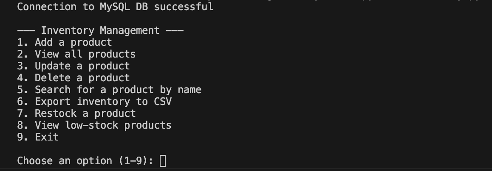
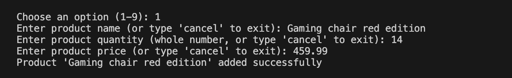
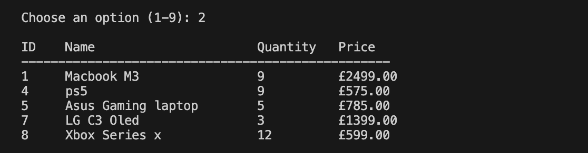
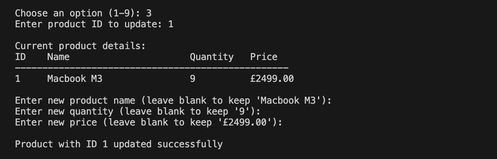
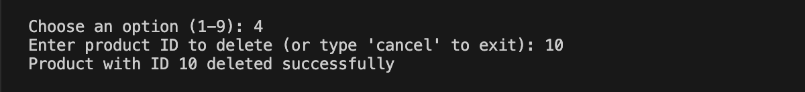
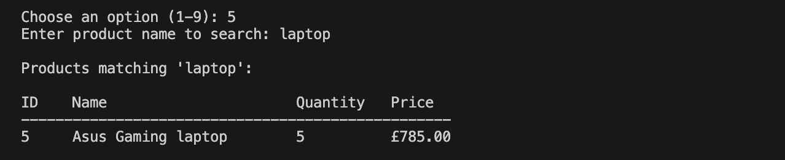
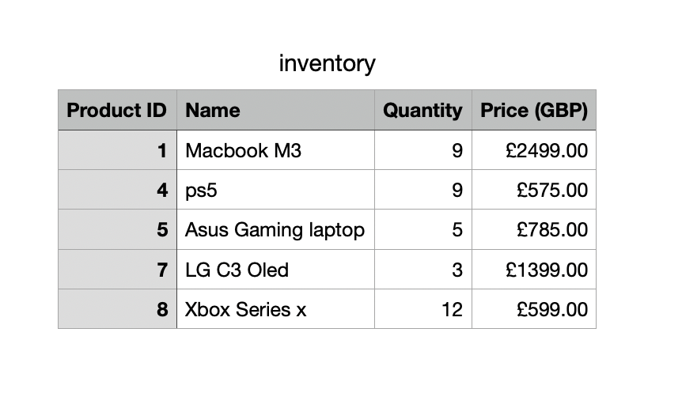
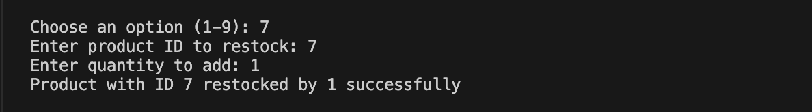
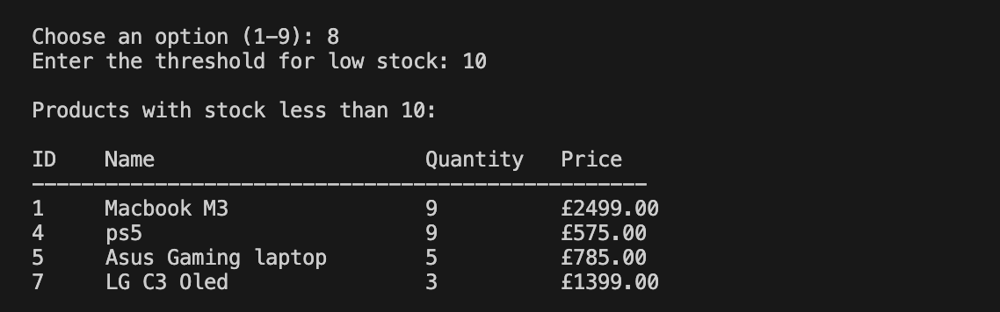
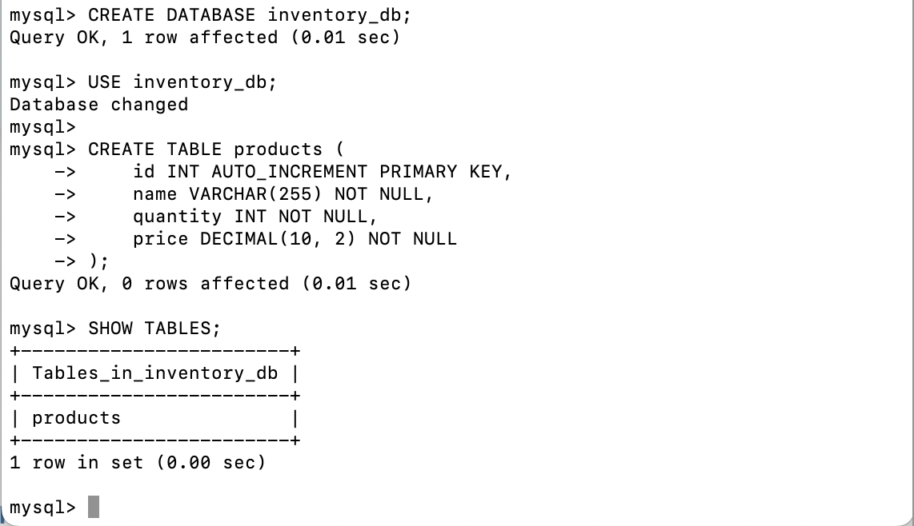

# Product Management system

- [Description](#description)
- [Program in action](#program-in-action)
- [Features](#features)
- [Technologies Used](#technologies-used)
- [Prerequisites](#prerequisites)
- [Installation](#installation)
- [Launching the App](#launching-the-app)
- [Usage](#usage)
- [Components](#components)
- [Creator](#creator)

## Description
The **Product Management System** is a simple yet powerful command-line tool designed to manage product inventories using a MySQL database. This system demonstrates efficient use of Python and SQL to perform essential CRUD operations (Create, Read, Update, Delete), allowing users to:

- Add new products to the inventory
- Update existing product details
- Delete products
- Search for products
- Track low-stock products and manage restocking

Built with Python and leveraging MySQL for backend storage, this project showcases my ability to integrate Python with a relational database, handle user input, perform database queries, and manage data efficiently. It's an ideal demonstration of practical skills in database management and command-line interface design.

## Program In Action

- The program's Main Menu:
 

- Adding a new product option 1:
 

- View all products option 2 on the menu:
 

- update a product option 3:
 

- Delete a product form the table option 4:
 

- Search product by name option 5:
 

- import product table inventory to CSV option 6:
 

 Inventory CSV file once opened up with a product table view:
 

- Restock a product option 7:
 

- View low-stock products option 8:
 

- Finally, Exit the application option 9:
 

## Features
- Add new products to the inventory
- View all products with formatted output
- Search for a product by name
- Update product details (name, quantity, price)
- Delete products from the inventory
- Export inventory data to a CSV file
- Track low-stock products and view restock suggestions
- Command-line interface (CLI) for easy navigation

## Technologies Used
- **Python**: Core programming language for building the logic and command-line interface.
- **MySQL**: Database used to store product details such as name, quantity, and price.
- **python-dotenv**: Used to manage environment variables securely.
- **csv module**: For exporting data to CSV files.
- **mysql-connector-python**: Python library for connecting to MySQL.

## Prerequisites
Before running the application, make sure you have the following installed:
- **Python 3.7+**
- **MySQL**
- **pip** (Python package manager)

## Installation
1. Clone the repository to your local machine:
```bash
   git clone https://github.com/M311HAN/product-management-system.git
   cd product-management-system
```

2. Install the required Python packages:
```bash
python3 -m pip install -r requirements.txt
```
This command will install all the necessary dependencies listed in the requirements.txt file.


3. Set up your MySQL database:

- Create a database and table for storing products:
```bash
CREATE DATABASE inventory_db;
USE inventory_db;

CREATE TABLE products (
    id INT AUTO_INCREMENT PRIMARY KEY,
    name VARCHAR(255) NOT NULL,
    quantity INT NOT NULL,
    price DECIMAL(10, 2) NOT NULL
);
```
Example:
 
 
4. Create a .env file in the root directory and add your MySQL credentials:
```bash
MYSQL_HOST=localhost
MYSQL_USER=root
MYSQL_PASSWORD=yourpassword
MYSQL_DATABASE=inventory_db
```

## Launching the App
1. Start your `MySQL` server.
2. Run the application in your terminal:
```bash
python3 inventory.py
```

## Usage
Once the app is launched, you'll be presented with a command-line interface offering various options for managing the product inventory:

1. **Add a product:** Enter product details such as name, quantity, and price.

2. **View all products:** See a list of all products in a neat table format.

3. **Search for a product:** Find products by entering a search term.

4. **Update product details:** Choose a product by ID and update its details.

5. **Delete a product:** Remove a product from the database by ID.

6. **Export inventory to CSV:** Save the product list as a CSV file.

7. **Restock a product:** Increase the stock level of a product.

8. **View low-stock products:** Check which products need restocking based on a threshold you set.

9. **Exit out the program.**

## Components
- **inventory.py:** The main Python script that handles all the CRUD operations and user interactions through the CLI.

- **inventory.csv:** The exported file when the inventory is exported.

- **.env:** (Hidden) file to store sensitive MySQL credentials.

- **requirements.txt:** Contains the list of dependencies required to run the project.

## Creator
Created by Melihhan. Feel free to connect with me on [Github!](https://github.com/M311HAN) and [explore more of my work!](https://github.com/M311HAN?tab=repositories)


### Additional Notes:
1. **requirements.txt**: Ensure to include a `requirements.txt` file for the Python dependencies. You can generate it using:
```bash
   python3 -m pip freeze > requirements.txt
```